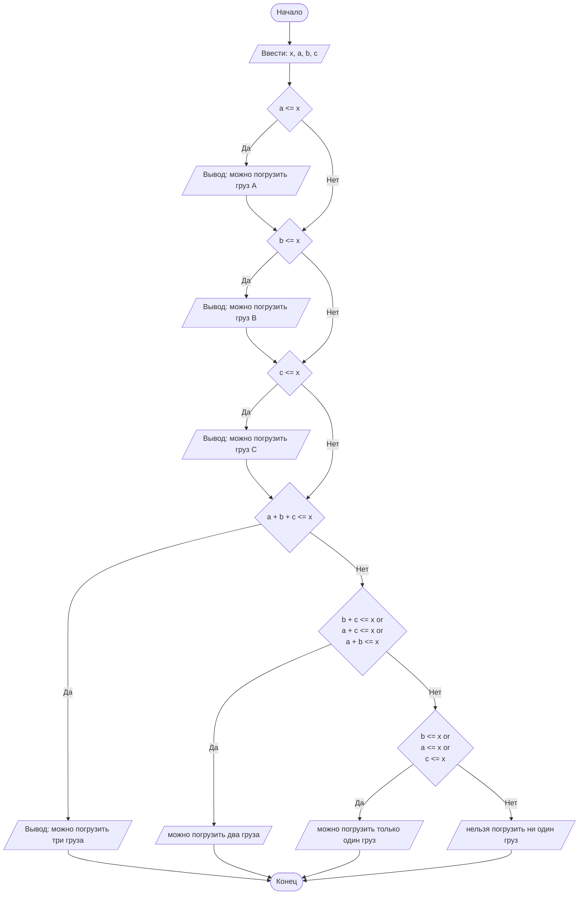

## Отчет по лабораторной работе № 1

#### № группы: `ПМ-2401`

#### Выполнил: `Никитин Иван Николаевич`

#### Вариант: `18`

### Содержание:

- [Постановка задачи](#1-постановка-задачи)
- [Входные и выходные данные](#2-входные-и-выходные-данные)
- [Выбор структуры данных](#3-выбор-структуры-данных)
- [Алгоритм](#4-алгоритм)
- [Программа](#5-программа)
- [Анализ правильности решения](#6-анализ-правильности-решения)

### 1. Постановка задачи

- Условия задачи

>В лифт с грузоподъёмностью X пытаются загрузить грузы весом A, B, C.
Проверить, какие из грузов могут быть загружены в лифт без превышения
допустимой массы, и определить, сколько грузов можно поместить в лифт.
На вход программы подаются натуральные числа X, A, B, C.

- Нужно узнать какие из грузов по отдельности влезают в лифт
- Нужно узнать максимальное количество грузов которые одновременно влезают в лифт

### 2. Входные и выходные данные

На вход подаются четыре переменных:

- целые;
- от нуля и до 2^31-1;


На выход даются строки:

- от одной строки до четырёх, т.к. этого требуют условия задачи.


### 3. Выбор структуры данных

Т.к. средняя грузоподъёмность обычного лифта примерно 350-500кг, то вводить вещественные числа, чтобы считать десятые и меньшие доли килограмма, нет смысла.

Тип данных int был выбран, т.к. некоторые грузовые лифты могут превосходить грузоподъёмность в 32768кг, и, соответственно, типы данных short и byte не подходили.

### 4. Алгоритм
На вход подаются четыре переменных, сначала грузоподъёмность лифта, потом массы грузов A, B и C соответственно.
Далее программа проверяет, какие из грузов можно отдельно поместить в лифт.
Потом проверяет можно ли поместить все три груза сразу, если нет, то проверяет все комбинации из двух грузов.
Если ни одну из комбинаций из двух грузов нельзя поместить в лифт, то программа проверяет поместиться ли хотя бы один из грузов.


### 5. Программа
```markdown
import java.io.PrintStream;
import java.util.Scanner;
public class Lab {
    public static Scanner in = new Scanner(System.in);
    public static PrintStream out = System.out;
    public static void main(String[] args) {
        int x = in.nextInt();
        int a = in.nextInt();
        int b = in.nextInt();
        int c = in.nextInt();
        if (a <= x) out.println("можно погрузить груз A");
        if (b <= x) out.println("можно погрузить груз B");
        if (c <= x) out.println("можно погрузить груз C");
        if (a + b + c <= x) out.println("можно погрузить три груза");
        else{
            if ((b + c <= x) || (a + c <= x) || (a + b <= x)) out.println("можно погрузить только два груза");
            else if ((a <= x) || (b <= x) || (c <= x)) out.println("можно погрузить только один груз");
                else out.println("нельзя погрузить ни один груз");
        }
    }
}
```

### 6. Анализ правильности решения

1. Тест если ни один из грузов не входит в лифт.

- Input:
    ```
    5 6 7 8 
    ```

- Output:
    ```
    нельзя погрузить ни один груз
    ```

2. Тест если все грузы входят в лифт одновременно.

- Input:
    ```
    6 1 2 3
    ```

- Output:
    ```
  можно погрузить груз A
  можно погрузить груз B
  можно погрузить груз C
  можно погрузить три груза
    ```